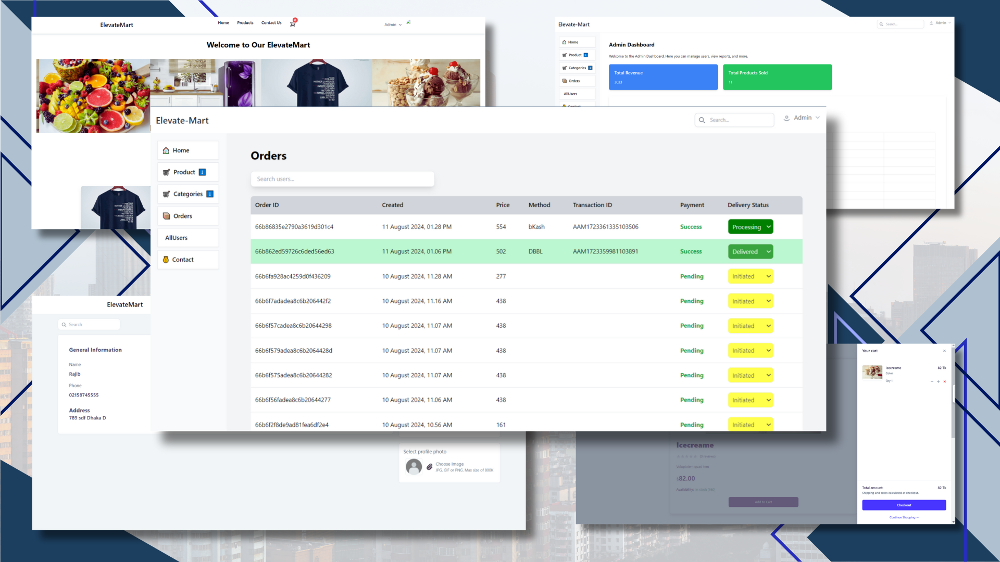

# Elevatemart eCommerce Platform



Elevatemart is a full-featured eCommerce platform built with the MERN (MongoDB, Express, React, Node.js) stack. This project was developed as an internship project, showcasing a modern and efficient online shopping experience.

## Features

- User authentication and authorization
- Product browsing and searching
- Shopping cart functionality
- Checkout process
- Order management
- User profile and order history
- Admin panel for product and user management

## Quick Start

### Prerequisites

- Node.js
- MongoDB
- npm

### Environment Variables

Rename `.env.example` to `.env` and update the variables:

```
NODE_ENV = development
PORT = 5000
MONGO_URI = your_mongodb_uri
JWT_SECRET = your_jwt_secret
```

### Installation

1. Install server dependencies:
   ```
   npm install
   ```

2. Install client dependencies:
   ```
   cd frontend
   npm install
   ```

### Running the Application

From the root directory:

```
npm run dev
```

This command will start both the server and the client concurrently.

#### For Admin (Rijon):

- On production, use:
  ```
  "scripts": {
    "dev": "concurrently \"npm run server\" \"npm run client\""
  }
  ```

- On development, use:
  ```
  "scripts": {
    "dev": "concurrently \"npm run server\" \"npm run client:dev\""
  }
  ```

## Project Structure

- `backend/`: Server-side code
- `frontend/`: Client-side code
- `uploads/`: Storage for uploaded images
- `docs/`: Project documentation and assets

## Technologies Used

- **Frontend:** NEXT, Redux, Tailwind
- **Backend:** Node.js, Express
- **Database:** MongoDB
- **Authentication:** JSON Web Tokens (JWT)

## Branching Strategy

We follow a specific branching strategy for our development process:

```
sprint-01-[feature-name]-[frontend/backend]-[developer-name]
```

Example:
```
sprint-01-registration-frontend-jumael
```

## License

This project is licensed under the MIT License.